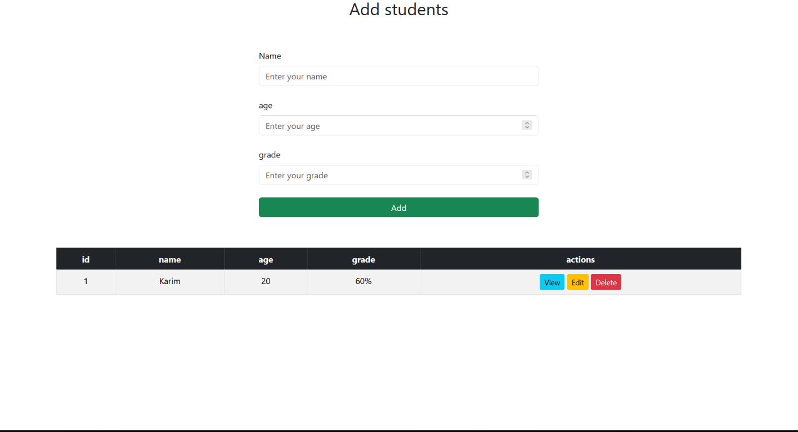

# Student Management System

A simple web-based student management system built with HTML, Bootstrap, and JavaScript.

## Overview

This project allows users to manage a student list directly in the browser. Users can:

- Add new students with name, age, and grade
- View student details
- Edit existing student entries
- Delete students from the list

The app uses a form to add or update students and displays the list in a responsive table.

## Features

- Add student records
- View a student's details
- Edit student information
- Delete student entries
- Responsive UI using Bootstrap

## Technologies

- HTML5
- CSS
- Bootstrap
- JavaScript

## Installation

No build tools or package manager are required. Simply open the project in a browser.

1. Clone or download the repository.
2. Open `index.html` in your web browser.

## Usage

1. Enter the student's name, age, and grade.
2. Click the **Add** button to add the student to the table.
3. Use the **View** button to display student details below the table.
4. Use the **Edit** button to load student data into the form for updates.
5. Use the **Delete** button to remove a student from the table.

## Project Structure

- `index.html` - Main page containing the form and student table.
- `css/bootstrap.min.css` - Bootstrap stylesheet for layout and styling.
- `css/style.css` - Custom styles for the page.
- `js/bootstrap.bundle.min.js` - Bootstrap JavaScript bundle.
- `js/main.js` - Custom application logic for adding, viewing, editing, and deleting students.

## Notes

- Data is stored only in the page state and is not persisted after a refresh.
- The grade field is displayed with a percent sign when shown in the table.
